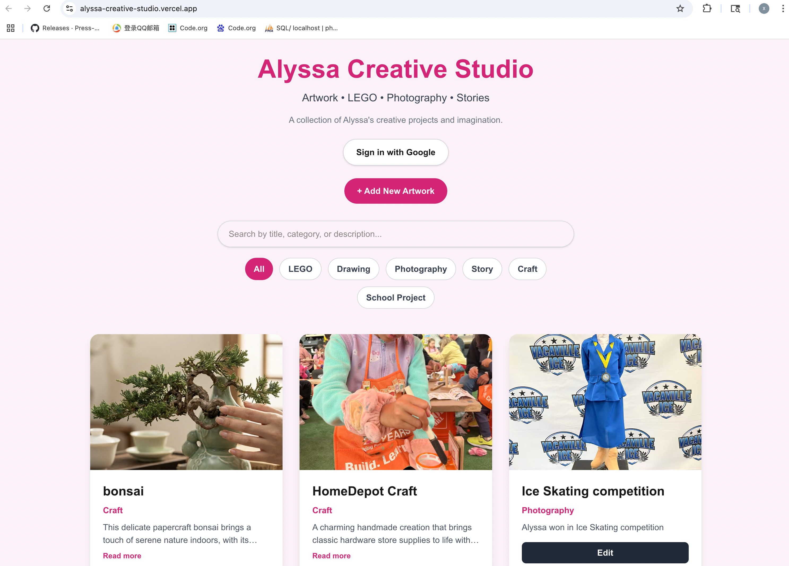
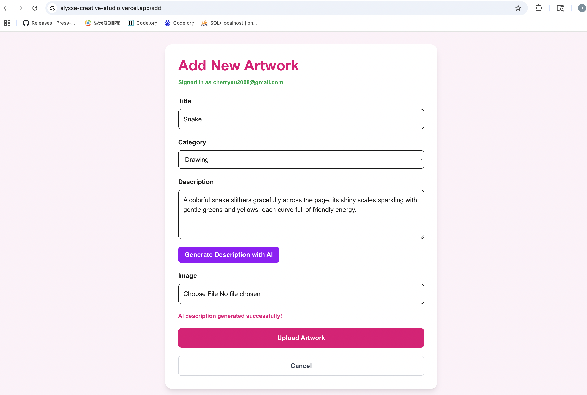
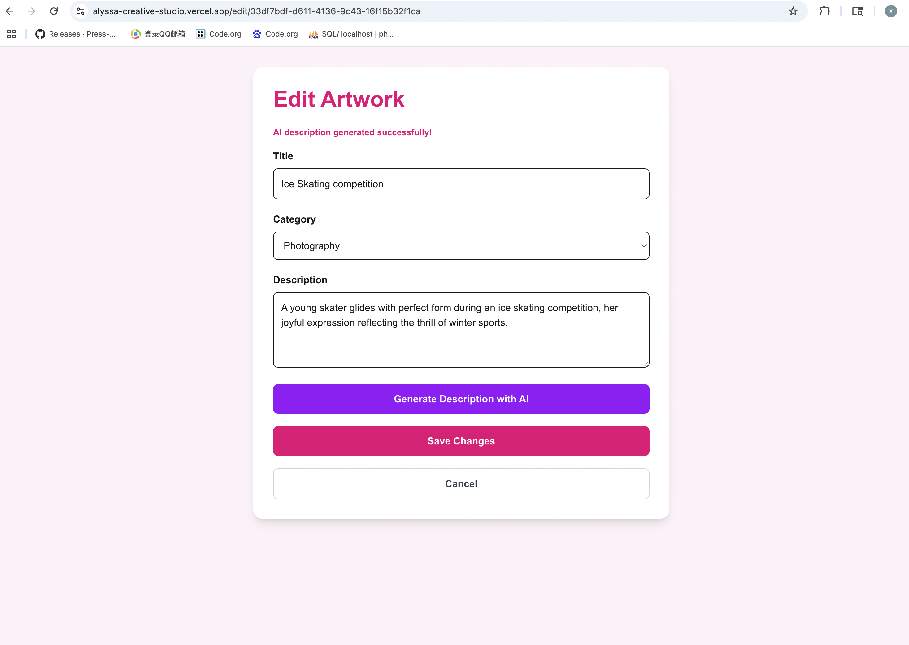

# Alyssa Creative Studio

Alyssa Creative Studio is a creative portfolio web application where users can upload, edit, search, and manage children's artwork projects. The app includes Google authentication, AI-generated descriptions, email notifications, image uploads, and responsive design.

---

## Live Demo

Vercel Deployment URL:

https://alyssa-creative-studio.vercel.app

---

## Features

- Google OAuth Login with Supabase
- Full CRUD Operations
  - Create Artwork
  - Read Artwork
  - Update Artwork
  - Delete Artwork
- Image Upload with Supabase Storage
- Search by title, category, or description
- Category filter buttons
- AI-generated artwork descriptions using DeepSeek API
- Email notifications using Resend
- Responsive mobile-friendly design
- Expand / Collapse description display
- Loading states and validation messages

---

## Tech Stack

- Next.js 15
- React
- Tailwind CSS
- Supabase
- DeepSeek API
- Resend Email API
- Vercel Deployment
- GitHub Codespaces

---

## Setup Instructions

### 1. Clone the repository

```bash
git clone https://github.com/GraceXXu/alyssa-creative-studio.git
```

---

### 2. Install dependencies

```bash
npm install
```

---

### 3. Create environment variables

Create a `.env.local` file and add:

```env
NEXT_PUBLIC_SUPABASE_URL=your_supabase_url
NEXT_PUBLIC_SUPABASE_ANON_KEY=your_supabase_anon_key
RESEND_API_KEY=your_resend_api_key
DEEPSEEK_API_KEY=your_deepseek_api_key
```

---

### 4. Run the development server

```bash
npm run dev
```

Open:

```bash
http://localhost:3000
```

---

## Screenshots

### Home Page



---

### Add Artwork Page



---

### Edit Artwork Page



---

## Required Features Completed

- Authentication with Google OAuth
- Database with Supabase
- Full CRUD operations
- File upload and display
- Search functionality
- Email notification feature
- AI integration through server-side API route
- UX polish features
- Responsive design
- Live Vercel deployment

---

## Author

Created by Xiaochen Xu for CIS-107 Final Project.